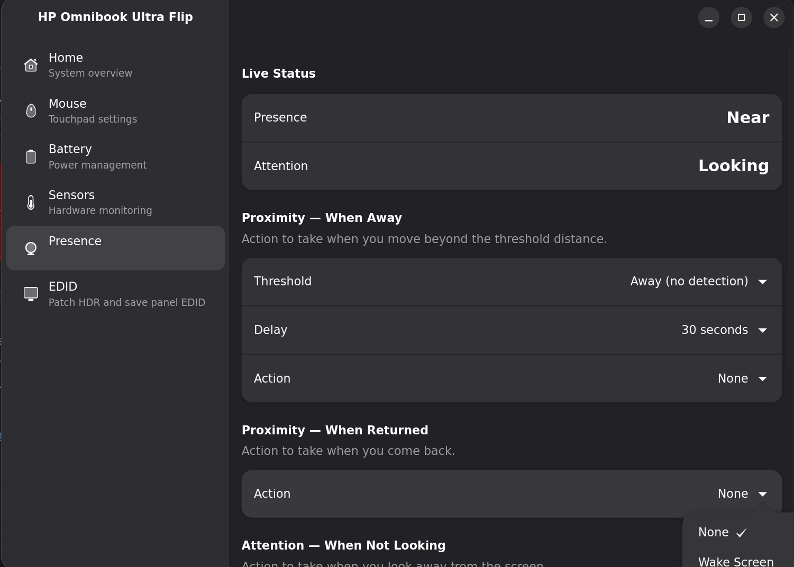

# OmniBook

A native Linux settings application for the **HP OmniBook Ultra Flip 14**, written in Rust.

This project began as a way to experiment with Rust and agentic coding, while attempting to close the feature gap between Windows and Linux for this hardware.



## Disclaimer

This project is an independent, community-developed effort and is **not affiliated with, endorsed by, sponsored by, or supported by HP Inc.** in any way.

"HP," the HP logo, and all related product names, model names, designs, and branding are trademarks or registered trademarks of HP Inc. and/or its affiliates. All references to HP products or trademarks in this project are made solely for identification, interoperability, and descriptive purposes, and remain the property of their respective owners.

Any code, protocols, or device-interaction logic in this project that relates to HP hardware was developed independently and does not incorporate any proprietary HP software or copyrighted materials. Use of this software with HP devices is entirely at your own risk. HP Inc. provides no support, warranty, or guarantee for this project, and the project authors are not responsible for any damage to hardware, loss of data, or warranty voidance that may result from its use.

For official support and software, please refer to HP Inc. directly.

## Features

- **Haptic touchpad** - configure intensity of the Synaptics SYNA3580 haptic touchpad
- **Presence detection** - configure proximity and attention-based actions (lock screen, dim, wake, custom commands)
- **EDID / HDR** - workaround for detecting the panel as HDR capable: reads the panel EDID from sysfs, patches DisplayID 2.0 HDR metadata into the CTA-861 block, and saves the patched binary

## Requirements

| Requirement | Notes |
| ----------- | ----- |
| **`lscpu`** | Used for CPU info in the home view |
| **`powerprofilesctl`** | Used for power profile switching in the battery view |
| **hidraw access** | `/dev/hidrawN` must be readable/writable for haptic control (see udev rules below) |

### udev rule (haptic touchpad)

The haptic device (VID `06CB`, PID `CFD2`) requires read/write access to its hidraw node. Add a udev rule granting your user (or the `input` group) access, then reload rules:

```sh
echo 'SUBSYSTEM=="hidraw", ATTRS{idVendor}=="06cb", ATTRS{idProduct}=="cfd2", MODE="0660", GROUP="input"' \
  | sudo tee /etc/udev/rules.d/99-omnibook-haptic.rules
sudo udevadm control --reload-rules && sudo udevadm trigger
```

## Development

### Enter the dev shell

GTK4 and libadwaita are only available inside the Nix dev shell:

```sh
nix develop
```

### Build and run

```sh
cargo run --bin omnibookd
cargo run --bin omnibook-rs
```

### Install via flake

Add the flake as an input and enable the NixOS module. This installs the app, sets up the required udev rule for haptic touchpad access, and starts `omnibookd` automatically at login.

```nix
# flake.nix
{
  inputs = {
    nixpkgs.url = "github:NixOS/nixpkgs/nixos-unstable";
    omnibook.url  = "github:timp4w/omnibook-rs";
  };

  outputs = { nixpkgs, omnibook, ... }: {
    nixosConfigurations.my-host = nixpkgs.lib.nixosSystem {
      modules = [
        omnibook.nixosModules.default
        {
          programs.omnibook.enable = true;
        }
      ];
    };
  };
}
```

**Run without installing:**

```sh
nix run github:timp4w/omnibook#omnibook-rs
```

**Build locally from source:**

```sh
nix build .#omnibook-rs
./result/bin/omnibook-rs
```
